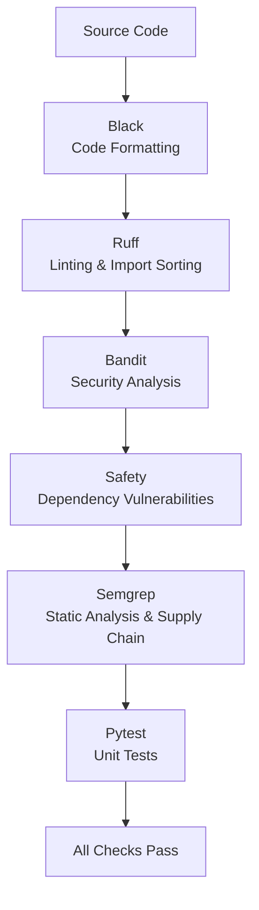

# Python Test Kit

A comprehensive Python testing toolkit with Docker-based CI/CD pipeline for code quality, security analysis, and automated testing.


## Testing Pipeline



## Testing

Run whole test suite:

```bash
docker-compose --profile test up --build test
docker-compose --profile test run test
```

To run black check suite separately:
```bash
docker-compose run --rm test black check .     # Check code formatting
docker-compose run --rm test black .           # Format code
```

To test with ruff and try out its auto-corrected function
```bash
docker-compose run --rm test ruff check .      # Lint code
docker-compose run --rm test ruff check --fix . # Fix linting issues
```

To run bandit security analysis:
```bash
docker-compose run --rm test bandit -r .       # Security analysis
```

To run safety checks:
```bash
docker-compose run --rm test safety check      # Check for dependency vulnerabilities
```

Customised unit tests:
```bash
docker-compose run --rm test pytest tests/
```

Semgrep:
```bash
# Full scan
docker-compose run --rm test bash -c \
  "git config --global --add safe.directory /usr/src/app && semgrep ci"

# To run locally without uploading results
docker-compose run --rm test bash -c \
  "git config --global --add safe.directory /usr/src/app && semgrep ci --dry-run"

# Or with Semgrep customised rules
docker-compose run --rm test semgrep \
  --config=p/python \
  --config=p/dockerfile \
  --config=p/ci \
  --config=p/owasp-top-ten \
  --config=p/security-audit \
  --config=p/secrets \
  --config=p/supply-chain \
  --metrics=off \
  --error \
  --no-git-ignore .
```

To spin up mock environment:

```bash
docker-compose up --build mock
docker-compose run --rm mock bash
```